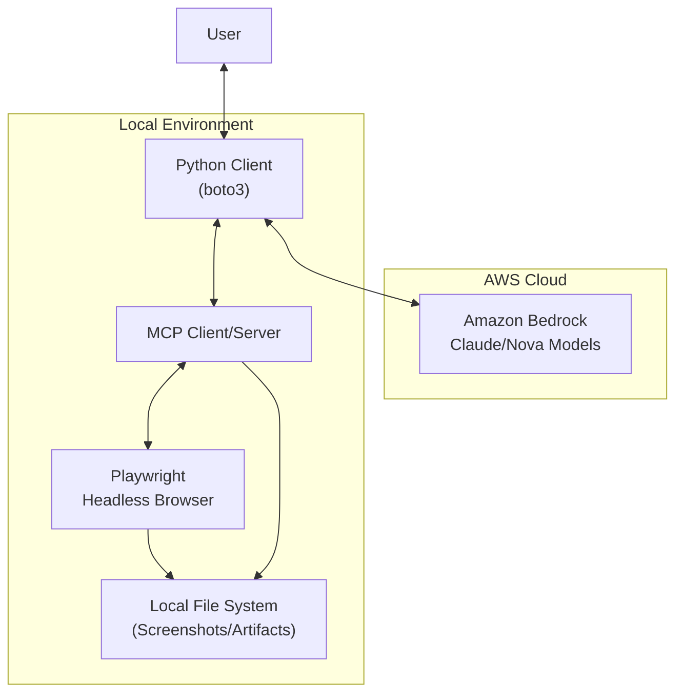
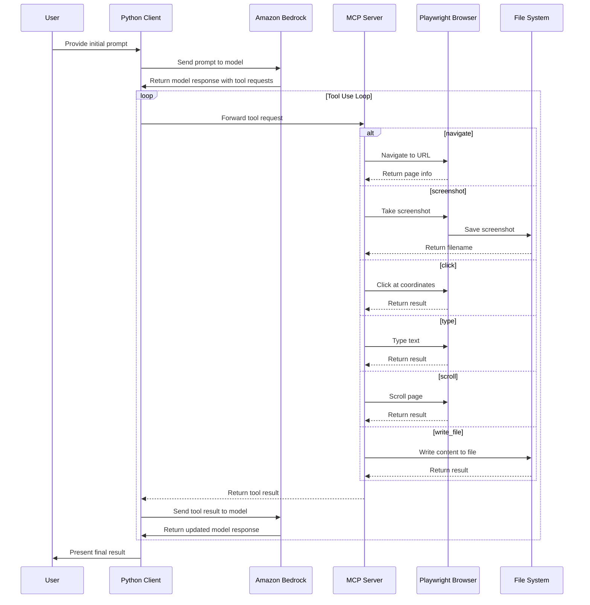

# Amazon Bedrock Web Tools - Threat Model Analysis

## Introduction

### Purpose

This project demonstrates how to use Amazon Bedrock with Anthropic Claude and Amazon Nova models to create a web automation assistant with tool use, human-in-the-loop interaction, and vision capabilities. The primary purpose is educational, allowing developers to understand how to integrate advanced language models with web automation capabilities.

### Project/Asset Overview

The project is a series of progressive examples that demonstrate different web automation capabilities using Amazon Bedrock. The major components include:

1. **Amazon Bedrock Client**: Uses the Bedrock API to communicate with Claude and Nova models
2. **Playwright Browser**: Controls a headless Chromium browser for web automation
3. **Web Interaction Tools**: Navigation, screenshots, clicking, text input, scrolling
4. **File Management**: Writing results to markdown files
5. **MCP Architecture**: Client-server separation with standardized protocol
6. **Conversation Management**: Media removal and conversation summarization for efficient token usage

The project uses several third-party libraries:
- boto3 for AWS API access
- pytest-playwright for browser automation
- mcp for Model Context Protocol implementation

The project is built and deployed as a series of Python scripts that can be run locally.

### Assumptions

| ID   | Assumption                                                                                | Comments                                                                                |
|------|------------------------------------------------------------------------------------------|-----------------------------------------------------------------------------------------|
| A-01 | The sample asset will be deployed into a non-production environment for educational purposes only. | The code is designed for demonstration and learning, not for production use. |
| A-02 | Users have appropriate AWS credentials and permissions to access Bedrock models.          | The code assumes AWS credentials are properly configured.                               |
| A-03 | The code runs in a trusted environment where local file access is permitted.              | The code writes files to local directories.                                             |
| A-04 | The browser automation is performed on trusted websites for educational purposes.         | The code can navigate to any website and interact with it.                              |

### References

- [Amazon Bedrock Documentation](https://docs.aws.amazon.com/bedrock/)
- [Playwright Documentation](https://playwright.dev/python/docs/intro)
- [Model Context Protocol](https://github.com/anthropics/anthropic-mcp)

## Solution Architecture

### Architecture Diagram

The architecture consists of a Python client that communicates with Amazon Bedrock models (Claude and Nova) using the boto3 library. The client also interacts with an MCP (Model Context Protocol) server that controls a headless browser using Playwright. The browser can navigate websites, take screenshots, and interact with web elements. Results and screenshots are saved to the local file system.

### Data Flow Diagrams

### Main Functionality/Use Cases of the Solution

1. **Web Navigation**: Navigate to specified URLs using Playwright
2. **Visual Analysis**: Take screenshots and analyze web page content
3. **Web Interaction**: Click on elements, type text, submit forms, scroll pages
4. **Information Gathering**: Search for information on websites
5. **Documentation**: Save search results to markdown files
6. **Conversation Management**: Efficiently manage long conversations with token optimization

### Assets/Dependency

| Asset Name | Asset Usage | Data Type | Comments |
|------------|-------------|-----------|----------|
| AWS Credentials | Used to authenticate with Amazon Bedrock | Credentials | Stored in local AWS configuration |
| Screenshots | Visual captures of web pages | Media | Stored in local filesystem with random UUIDs |
| Generated markdown files | Documentation of search results | Content | Stored in local filesystem |
| Browser session | Temporary browser instance for web automation | Session | Automatically cleaned up after execution |
| Conversation history | Record of interactions with the model | Content | Managed with token optimization |

## Threats & Mitigations

### Threat Actors

| Threat Actor # | Threat Actor Description |
|----------------|--------------------------|
| TA1 | A threat actor from the internet |
| TA2 | A threat actor with local file system access |
| TA3 | A threat actor with AWS credential access |
| TA4 | A threat actor controlling websites visited by the browser |

### Threat & Mitigation Detail

| Threat # | Priority | Threat | STRIDE | Affected Assets | Mitigations | Decision | Status/Notes |
|----------|----------|--------|--------|----------------|-------------|----------|--------------|
| T-001 | High | A threat actor from the internet (TA1) could intercept API calls to Amazon Bedrock, leading to exposure of prompts and responses | Information Disclosure | AWS Credentials, Conversation history | M-001 | Mitigate | Implemented |
| T-002 | Medium | A threat actor with local file system access (TA2) could access generated files and screenshots | Information Disclosure | Screenshots, Generated markdown files | M-002 | Accept | Partially implemented |
| T-003 | High | A threat actor with AWS credential access (TA3) could use the credentials to access AWS services | Elevation of Privilege | AWS Credentials | M-003 | Mitigate | Not explicitly implemented |
| T-004 | Medium | A threat actor controlling websites (TA4) could execute malicious code in the browser context | Tampering, Information Disclosure | Browser session | M-004 | Mitigate | Implemented |
| T-005 | Low | A threat actor could manipulate the MCP server to execute arbitrary code | Elevation of Privilege | Local file system | M-005 | Mitigate | Implemented |
| T-006 | Medium | A threat actor could exploit the browser automation to perform unintended actions on websites | Tampering | Browser session | M-006 | Accept | Implemented |

## APPENDIX B - Mitigations

| Mitigation Number | Mitigation Description | Threats Mitigating | Status | Related BSC | Comments |
|-------------------|------------------------|-------------------|--------|------------|----------|
| M-001 | Use of TLS for all API calls to Amazon Bedrock | T-001 | Implemented | | boto3 uses HTTPS by default for all AWS API calls |
| M-002 | Restrict file system access to the local user only | T-002 | Partially implemented | | Relies on OS file permissions, no explicit permission setting in code |
| M-003 | Use of temporary credentials with minimal permissions | T-003 | Not explicitly implemented | | Code relies on default AWS credential provider chain |
| M-004 | Browser runs in headless mode with restricted capabilities | T-004 | Implemented | | Playwright runs in headless mode by default |
| M-005 | MCP server runs locally and accepts connections only from localhost | T-005 | Implemented | | Uses stdio transport for local process communication |
| M-006 | Clear documentation that the tool should only be used on trusted websites | T-006 | Implemented | | README mentions educational purpose |