# AWS Bedrock Web Tools - Components Overview

This document provides a simplified overview of the key components for each step in the project.

## Step 1: Basic Setup (No Tools)

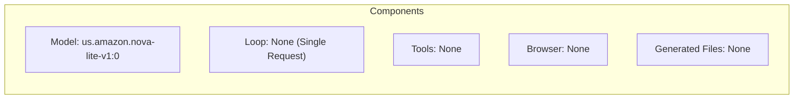

## Step 2: Tool Definition

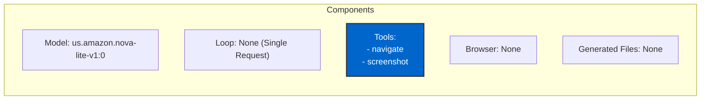

## Step 3: Tool Loop

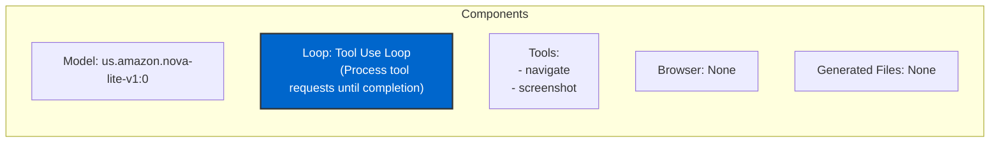

## Step 4: Tool Invocation

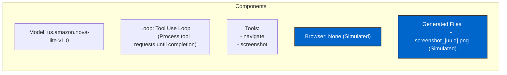

## Step 5: Headless Browser

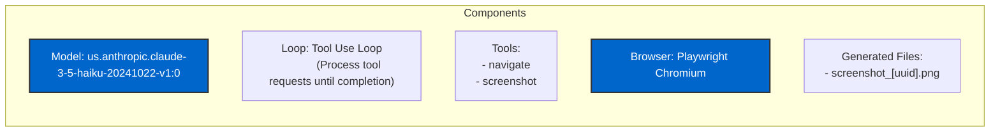

## Step 6: Human-in-the-Loop

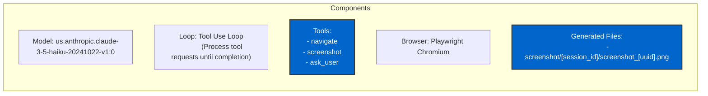

## Step 7: Vision Capabilities

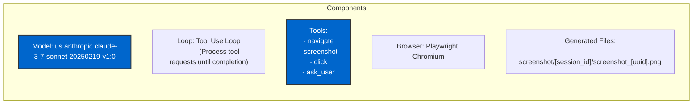

## Step 8: Text Input with Form Submission

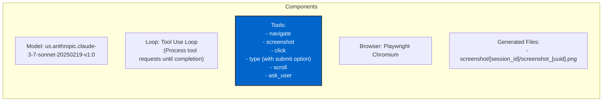

## Step 9: File Writing

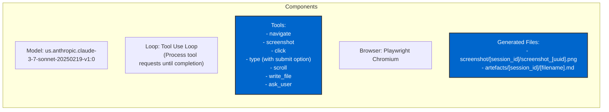

## Step 10: MCP Integration

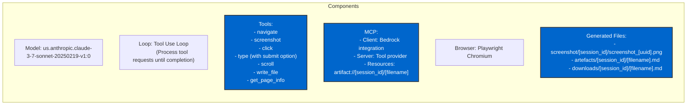

## Step 11: Conversation History Management

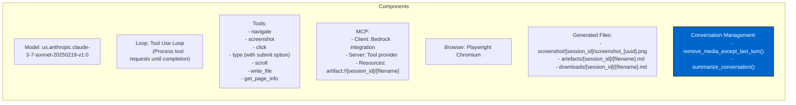

## Model Evolution

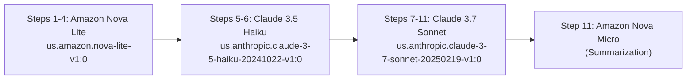

### Key Model Transition Points

1. **Nova Lite to Claude 3.5 Haiku (Step 4 → 5)**:
   - Enabled sending both tool results and browser context in the same conversation turn

2. **Claude 3.5 Haiku to Claude 3.7 Sonnet (Step 6 → 7)**:
   - Stronger reasoning capabilities for complex web navigation tasks
   - Near pixel-perfect vision for analyzing screenshots
   - Enhanced ability to identify and interact with visual elements
   - Better performance with vision-based clicking and form interactions

3. **MCP Integration (Step 10)**:
   - Standardized communication protocol between model and tools
   - Separation of client (model interface) and server (tool provider)
   - Resource handling for artifacts with URI-based addressing
   - Enhanced modularity and extensibility of the system

4. **Conversation Management (Step 11)**:
   - Efficient token usage through media removal and conversation summarization
   - Multi-model approach: Claude 3.7 Sonnet for main conversation, Amazon Nova Micro for summarization
   - Tool use/result pair preservation for API validation compliance</span>

## Tool Evolution

```mermaid
flowchart TD
    T1["Step 1: None"] -->
    T2["Step 2-4: navigate, screenshot"] -->
    T5["Step 5: navigate, screenshot (real browser)"] -->
    T6["Step 6: + ask_user"] -->
    T7["Step 7: + click"] -->
    T8["Step 8: + type, scroll"] -->
    T9["Step 9: + write_file"] -->
    T10["Step 10: + MCP integration"] -->
    T11["Step 11: + Conversation Management"]